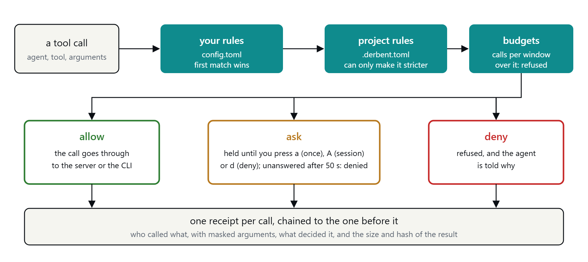
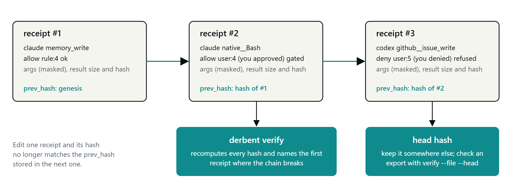

<picture>
  <source media="(prefers-color-scheme: dark)" srcset="docs/assets/derbent-lockup-on-dark.svg">
  
</picture>

# Derbent

One guarded pass for all your coding agents.

A derbent was a guarded post on an Ottoman mountain pass: its keepers decided who went through and kept a
record of everyone who did. Derbent does the same for your coding agents' tool calls.

Claude Code, Codex, GitHub Copilot CLI and Antigravity CLI connect to Derbent as one MCP server, and your
other MCP servers sit behind it. Each CLI's pre-tool hook sends its built-in tools, such as the shell and
file edits, through the same gate. Every call is decided by your rules and written down.


It is one binary for Windows, macOS and Linux. There is no daemon and no network listener: a SQLite file
is the only shared state ([ADR 0001](docs/adr/0001-no-daemon.md)).

## What you get

- **One gate for four CLIs.** The same rules apply to MCP tools and to built-in tools such as the shell.
- **Rules that allow, deny or ask**, by agent, tool and argument. The first match wins.
- **Approvals.** A call your rules ask about waits until you press `a` in the terminal UI, or is denied
  after 50 seconds by default.
- **Receipts.** Every call gets a hash-chained receipt, and `derbent verify` names the first receipt
  where the chain breaks after one was edited, moved, inserted or removed. Keep the head hash it prints
  to catch the newest ones being deleted too.
- **Shared memory and handoffs.** Agents keep notes per repository and can leave tasks for each other.
- **Guards for the long run:** budgets for agents stuck in a loop, pins that hold back a server's tool
  when its definition changes, and project rules a repository can use to be stricter.

## Install

Download the binary for your system and `SHA256SUMS` from the
[latest release](https://github.com/tunahanaliozturk/derbent/releases/latest), check the hash, and put it
on your `PATH` as `derbent` (`derbent.exe` on Windows):

```bash
# Linux on amd64; the other files differ only in the end of the name
curl -LO https://github.com/tunahanaliozturk/derbent/releases/download/v1.0.0/derbent-v1.0.0-linux-amd64
curl -LO https://github.com/tunahanaliozturk/derbent/releases/download/v1.0.0/SHA256SUMS
sha256sum --ignore-missing -c SHA256SUMS
install -m 755 derbent-v1.0.0-linux-amd64 ~/.local/bin/derbent
```

Or build it with Go 1.27 or later:

```bash
go install github.com/tunahanaliozturk/derbent/cmd/derbent@latest
```

Every release can be rebuilt byte for byte from its tag. [Install and set up](docs/install.md) has the
other systems, how to check a release, and each CLI's entries by hand.

## Quick start

```bash
derbent init --preset balanced   # add Derbent to each CLI it finds, and write a first config
derbent doctor                   # check what init wrote
derbent                          # open the terminal UI in a terminal of its own
```

`derbent init` shows every change and asks once before it makes any. It copies each file it changes
first and never replaces an entry you already have. With `--dry-run` it only shows the changes. Two of
them, from a real run with the paths shortened:

```text
claude: ~/.claude.json
  copied first to ~/.claude.json.derbent-backup-20260930T205424Z
  runs:
    claude mcp add --scope user derbent -- ~/bin/derbent mcp --agent claude
derbent: ~/.config/derbent/config.toml
  a new file
  adds the balanced preset (derbent init --preset balanced --print shows it)
```

It also adds the `derbent gate` hook to each CLI's settings; [Install and set up](docs/install.md) shows
every entry. Start your agents as usual. Their calls now appear in the UI, and calls the rules ask about
wait there for you. Only Claude Code has been checked in real sessions; the entries for the other three
CLIs follow their documentation (see [Built-in tools](docs/built-in-tools.md)).

To put your other MCP servers behind the gate, so each agent needs only the one `derbent` entry, see
[Downstream servers](docs/servers.md).

## How a call is decided



Rules live in `config.toml` in your user config directory (`%AppData%\derbent\` on Windows,
`~/.config/derbent/` on Linux, `~/Library/Application Support/derbent/` on macOS). A downstream MCP
server's tools are named `<server>__<tool>`, and a CLI's built-in tools `native__<tool>`:

```toml
[[rule]]
tool   = "github__issue_read"
action = "allow"

[[rule]]
tool   = "github__*"          # every other GitHub tool waits for you
action = "ask"

[[rule]]
agent  = "claude"
tool   = "native__Bash"       # Claude Code's shell, through the hook
args   = { command = "git push*" }
action = "ask"

[[rule]]
action = "allow"              # the last rule has no condition
```

To see how a call would be decided before it happens:

```bash
derbent explain --agent claude --tool native__Bash --args '{"command":"git push origin main"}'
```

It prints each rule and why it matches or not, down to the first match, then the project's rules,
budgets, pin and grant, and ends with `verdict:  ask (rule:3)` for this call under the rules above. [Rules](docs/rules.md) covers globs, the three presets (`watch`,
`balanced`, `strict`), project rules, budgets and rule suggestions.

## Receipts



```bash
derbent verify                              # count, head hash, and whether the chain is intact
derbent receipts --agent codex --since 1h   # also --tool, --project, --limit, --json
```

A receipt keeps the arguments after masking secrets, and only the size and hash of what a tool returned
([ADR 0004](docs/adr/0004-hash-chained-receipts.md)). Someone who can write the database could still
rewrite the whole chain or delete the newest receipts, so keep the head hash somewhere else if you want
to be able to tell later. [Receipts and verify](docs/receipts.md) covers exports that can be
checked without the database.

## Commands

| Command | What it does | More |
|---|---|---|
| `derbent` | Terminal UI: waiting calls, agents, live receipts, memory, grants | [Approvals](docs/approvals.md) |
| `derbent init`, `derbent doctor` | Add Derbent to each CLI, then check the setup | [Install](docs/install.md) |
| `derbent mcp --agent <name>` | The MCP server each CLI starts | [Install](docs/install.md) |
| `derbent gate --agent <name>` | The pre-tool hook for built-in tools | [Built-in tools](docs/built-in-tools.md) |
| `derbent pending`, `approve`, `deny` | Answer waiting calls from any shell | [Approvals](docs/approvals.md) |
| `derbent grants`, `revoke` | List and take back session grants | [Approvals](docs/approvals.md) |
| `derbent explain` | Show how a call would be decided | [Rules](docs/rules.md) |
| `derbent suggest` | Print the rules your answers point to | [Rules](docs/rules.md#rule-suggestions) |
| `derbent config check` | Validate the config and list each server's tools | [Servers](docs/servers.md) |
| `derbent pins` | See and accept changed downstream tools | [Servers](docs/servers.md#tool-pins) |
| `derbent receipts`, `verify` | Read, export and verify receipts | [Receipts](docs/receipts.md) |
| `derbent handoffs` | List the tasks agents left for each other | [Memory and handoffs](docs/memory-and-handoffs.md) |
| `derbent version` | Print the release | |

## Overhead

Measured on GitHub's hosted runners (AMD EPYC 7763, 4 vCPUs) on 2026-09-27, median of ten runs at p50,
from [docs/benchmark-results](docs/benchmark-results/README.md):

| | Linux | Windows |
|---|---|---|
| MCP tool call, direct to the server | 304.5 µs | 353.0 µs |
| MCP tool call, through the gate | 825.5 µs | 1033.0 µs |
| Starting the binary and exiting | 4.316 ms | 46.91 ms |
| Hook call, `derbent gate`, allowed | 7.381 ms | 83.03 ms |

The gate adds 521 µs to an MCP call on Linux and 680 µs on Windows, for the extra stdio hop, the rule
decision, the project rules check and the receipt written to SQLite. A hook call costs about 3 ms more
than starting the binary on Linux and 36 ms more on Windows, where most of its cost is the process start. The numbers come
from one run on shared runners; the results page has p99, calls per second and the caveats.

## Limits

The whole list, with the reasons, is under [Known limits and risks](docs/design.md#known-limits-and-risks).
The ones to know first:

- Only calls that pass through the gate are seen. Tools a CLI never shows its hook, such as Codex's hosted
  web search, are outside it.
- Only Claude Code's hook has been checked in a real session. The Codex, Copilot CLI and Antigravity CLI
  adapters follow each CLI's documentation.
- Argument globs match strings, not meaning: `git push*` does not match `cd repo && git push`.
- Approvals guard against mistakes and prompt injection inside MCP. They do not stop an agent that can
  already run shell commands as you: it can run `derbent approve` itself.
- A receipt export shows its last run unchanged only against a head you kept, and never that nothing was
  left out of it.
- A suggestion refuses the shells, launchers and operators it knows, but a text rule can be fooled and
  those lists cannot be complete, and an `allow` for a command prefix lets any options through.
- A handoff's address is a label, not an identity: any agent that can call `handoff_take` can claim every
  open handoff addressed to `*`.
- Approvals depend on you watching. Unattended, `ask` means denied after the timeout.
- Pins trust the first definition they see, including a new tool that an update adds to a pinned server,
  so name the tools you allow for a server whose updates you do not review. A budget can be passed by the calls in flight at the same moment.
- CI runs the tests on Windows and Linux and only builds on macOS.

## Docs

- [Install and set up](docs/install.md): every system, checking a release, each CLI by hand
- [Rules](docs/rules.md): rules, presets, `explain`, project rules, budgets, suggestions
- [Approvals and the UI](docs/approvals.md): keys, grants, answering from a shell
- [Built-in tools](docs/built-in-tools.md): the hook, tool names per CLI, what each CLI covers
- [Downstream servers and tool pins](docs/servers.md)
- [Receipts and verify](docs/receipts.md): what a receipt holds, exports, `verify --file`
- [Memory and handoffs](docs/memory-and-handoffs.md)
- [Demo](docs/demo.md): a transcript of two real Claude Code sessions sharing one gate
- [Design](docs/design.md), the contract for the build, and the [decisions](docs/adr/README.md) behind it

Changes are listed in the [changelog](CHANGELOG.md). To build, test or send a change, see
[CONTRIBUTING.md](CONTRIBUTING.md). To report a vulnerability, see [SECURITY.md](SECURITY.md).

## Licence

Apache 2.0. See [LICENSE](LICENSE).
